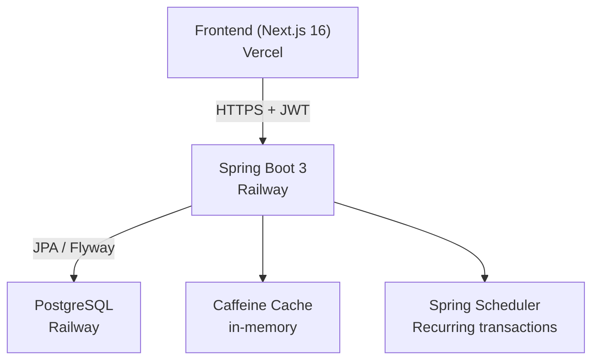

# FinTrack API

> Personal finance management REST API built with Java 21 and Spring Boot 3 — portfolio project demonstrating production-grade backend engineering.

[](https://openjdk.org/projects/jdk/21/)
[](https://spring.io/projects/spring-boot)
[](https://github.com/JoaoGsm05/fintrack-api)
[](https://inspiring-freedom-production-dece.up.railway.app)

**Live demo**
| Resource | URL |
|----------|-----|
| Frontend | https://fintrack-web-tau.vercel.app |
| API (Swagger) | https://inspiring-freedom-production-dece.up.railway.app/swagger-ui.html |

---

## What this project is

FinTrack is a REST API for personal finance tracking. Users can register, create bank accounts, categorize transactions, set monthly budgets with alerts, and schedule recurring expenses. The project was designed as a portfolio piece — every technical decision was made to be defensible in a job interview.

---

## Architecture



### Domain model

```
User
 ├── Account       (bank account, wallet, credit card)
 ├── Category      (hierarchical: parent → child, e.g. Transport > Uber)
 ├── Transaction   (INCOME / EXPENSE, linked to Account + Category)
 ├── Budget        (monthly limit per category, with 50/80/100% alerts)
 └── RecurringTransaction  (fixed expenses — auto-generates Transactions via @Scheduled)
```

---

## Tech stack

| Layer | Technology | Version |
|-------|-----------|---------|
| Language | Java | 21 (LTS) |
| Framework | Spring Boot | 3.3.5 |
| Security | Spring Security + jjwt | 6 / 0.12.6 |
| Persistence | Spring Data JPA + Hibernate | — |
| Migrations | Flyway | — |
| Mapping | MapStruct | 1.6.2 |
| Cache | Spring Cache + Caffeine | 3.1.8 |
| Scheduler | Spring Scheduler | — |
| Documentation | SpringDoc OpenAPI | 2.6.0 |
| Validation | Jakarta Bean Validation | — |
| Build | Maven | — |
| Test DB | H2 in-memory | 2.2.220 |
| Production DB | PostgreSQL (Railway) | — |
| Boilerplate | Lombok | 1.18.34 |

---

## API endpoints

### Auth
| Method | Endpoint | Auth | Description |
|--------|----------|------|-------------|
| POST | `/api/auth/register` | Public | Create account |
| POST | `/api/auth/login` | Public | Get access + refresh token |
| POST | `/api/auth/refresh` | Public | Rotate refresh token |

### Core
| Method | Endpoint | Description |
|--------|----------|-------------|
| GET/POST | `/api/accounts` | List / create bank accounts |
| GET/PUT/DELETE | `/api/accounts/{id}` | Read / update / soft-delete |
| GET/POST | `/api/categories` | List / create categories (hierarchical) |
| GET/PUT/DELETE | `/api/categories/{id}` | Read / update / soft-delete |
| GET/POST | `/api/transactions` | List (with filters) / create |
| GET/PUT/DELETE | `/api/transactions/{id}` | Read / update / soft-delete |

`GET /api/transactions` supports dynamic filtering via query params: `type`, `accountId`, `categoryId`, `startDate`, `endDate`, `minAmount`, `maxAmount`, `description`, plus `page` / `size` / `sort`.

### Budgets & Recurring
| Method | Endpoint | Description |
|--------|----------|-------------|
| GET/POST | `/api/budgets` | List / create budgets |
| GET/PUT/DELETE | `/api/budgets/{id}` | Read / update / soft-delete |
| GET/POST | `/api/recurring` | List / create recurring transactions |
| GET/PUT/DELETE | `/api/recurring/{id}` | Read / update / soft-delete |

### Reports
| Method | Endpoint | Description |
|--------|----------|-------------|
| GET | `/api/reports/expenses-by-category` | Spending summary grouped by category |
| GET | `/api/reports/export-expenses-csv` | Download expenses as CSV |

Both report endpoints accept `?start=YYYY-MM-DD&end=YYYY-MM-DD`.

Full interactive documentation at `/swagger-ui.html`.

---

## Running locally

### Prerequisites
- Java 21
- Maven (or use the wrapper)

### 1. Clone and configure

```bash
git clone https://github.com/JoaoGsm05/fintrack-api.git
cd fintrack-api
```

### 2. Run with dev profile (H2 in-memory, no external dependencies)

**Linux / macOS**
```bash
./mvnw spring-boot:run -Dspring-boot.run.profiles=dev
```

**Windows**
```powershell
.\scripts\mvn-java21.ps1 spring-boot:run -Dspring-boot.run.profiles=dev
```

API starts on `http://localhost:8080`. Swagger at `http://localhost:8080/swagger-ui.html`.

### 3. Run tests

```powershell
.\scripts\mvn-java21.ps1 clean test
```

152 tests — unit (Mockito) + integration (@SpringBootTest + H2 + Flyway).

---

## Environment variables (production)

| Variable | Description |
|----------|-------------|
| `SPRING_PROFILES_ACTIVE` | Set to `prod` |
| `DATABASE_URL` | `jdbc:postgresql://host:port/dbname` |
| `DATABASE_USERNAME` | PostgreSQL user |
| `DATABASE_PASSWORD` | PostgreSQL password |
| `JWT_SECRET` | 256-bit random string (`openssl rand -hex 32`) |
| `APP_CORS_ALLOWED_ORIGINS` | Comma-separated allowed origins |
| `SPRING_MAIL_HOST` | SMTP host (optional — for budget alerts) |
| `SPRING_MAIL_USERNAME` | SMTP user |
| `SPRING_MAIL_PASSWORD` | SMTP password or app password |

---

## Key technical decisions

**JWT with refresh token rotation** — every `/refresh` call invalidates the old refresh token and returns a new pair. Stateless but more secure than long-lived access tokens.

**FKs as UUID, not @ManyToOne** — services do explicit lookups. Zero N+1 queries by design. Trade-off: slightly more code in service layer, but total control over query behavior.

**Multi-tenancy by row** — every entity has `userId`. Every query filters by the authenticated user extracted from `SecurityContextHolder`. A user can never read another user's data.

**Soft delete everywhere** — `deleted_at TIMESTAMP` instead of boolean. Allows temporal auditing and simplifies "undo" scenarios. Queries always append `AND deleted_at IS NULL`.

**Dynamic filtering with Specification** — `TransactionSpecification` returns `null` for unset filters; Spring Data silently ignores null Specifications. No query string building, no reflection.

**Budget alerts via AOP** — `BudgetAlertAspect` intercepts `TransactionService.create()`. Business logic stays clean; the alert side-effect is separate. Thresholds (50%, 80%, 100%) are checked once and stored to prevent repeated notifications.

**MapStruct + Lombok + Java 21 records** — required adding `lombok-mapstruct-binding:0.2.0` to annotation processor paths. Without it, MapStruct 1.6.2 strips canonical constructors from records when processed alongside Lombok, causing silent compilation failures.

**ProblemDetail (RFC 7807)** — native in Spring 6, no extra library. All errors return `type`, `title`, `status`, `detail`. Stacktraces never leak to clients.

---

## What I'd do differently / next steps

- **Testcontainers** — current integration tests use H2, which masks PostgreSQL-specific behavior (e.g. `ILIKE`, `::uuid` casts). Testcontainers would make them more realistic.
- **Budget CRUD in the frontend** — the API is complete; the UI screen was deprioritized.
- **Full-text search** — description filtering currently uses `LIKE 'prefix%'` with a B-tree index. For a real product, `pg_trgm` + GIN index or a search service would be better.
- **Email queue** — budget alert emails are sent synchronously in the request thread. A queue (Redis + Spring AMQP) would make this reliable and retryable.
- **Refresh token persistence** — tokens are currently validated by signature only. A blocklist (Redis) would allow true token revocation.

---

## Project structure

```
com.fintrack.api
├── auth/           JWT auth, register, login, refresh
├── account/        Bank account CRUD
├── category/       Hierarchical category CRUD
├── transaction/    Transaction CRUD + dynamic Specification filters
├── budget/         Budget CRUD + AOP alert aspect
├── recurring/      Recurring transaction CRUD + @Scheduled generator
├── report/         Aggregation queries + CSV export
└── shared/
    ├── audit/      BaseEntity (createdAt, updatedAt, createdBy)
    ├── config/     Security, Cache, OpenAPI, CORS, JPA configs
    ├── dto/        PagedResponse
    └── exception/  GlobalExceptionHandler + custom exceptions
```

---

## Author

**João Guilherme Souza de Mendonça**
Computer Engineering student — UNAERP, Ribeirão Preto SP

[](https://github.com/JoaoGsm05)
[](https://www.linkedin.com/in/joaoguilherme-souza-dev/)
